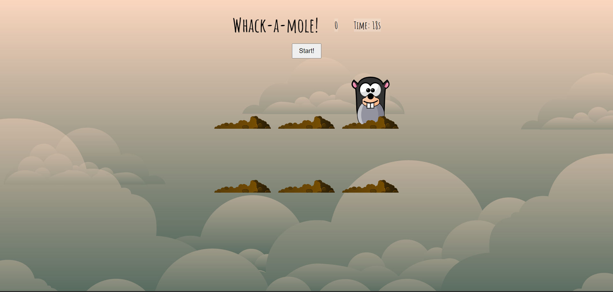

## Whack-A-Mole-Game

A simple Whack-a-Mole game implemented using HTML, CSS, and JavaScript.

## How to Play

1. Open `index.html` in your web browser.
2. Click the "Start" button to begin the game.
3. Click on the moles as they appear to score points.
4. The game lasts for 30 seconds. Try to score as many points as possible!

## Files

- `index.html`: The main HTML file.
- `styles.css`: The CSS file for styling the game.
- `mole.js,irt.js`: The JavaScript file containing the game logic.
- `background.jpg`:The Background of the game.

## Screenshot

## Authors

* [@Ashwin Ramanathan](https://www.github.com/ashwinramanathan25)
